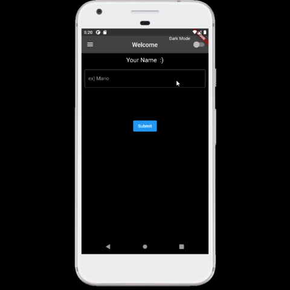
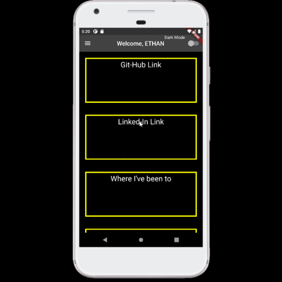
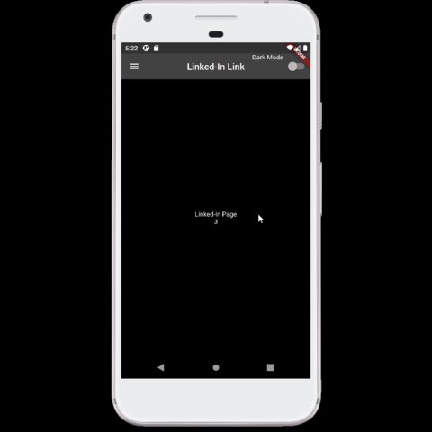
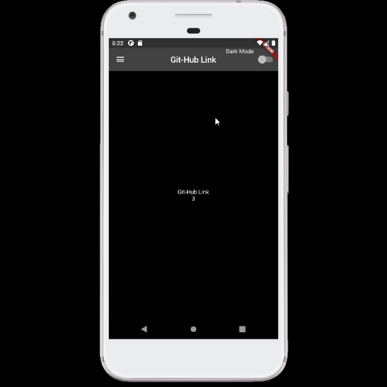

# Flutter Project
- - -
## About this Project
* An application created to easily access links such as GitHub and LinkedIn and other information on a mobile phone.
* Basic 'dark mode' and sidebar functions are also added.
* Project written by Flutter
- - - 
## OverView   

   
   
   
   
   
   
   
   
   
   
   

- - -
## Code Preview
### Links (Linked-in, git hub)   
```
child: Container(
          width: double.infinity,
          child: Column(
            mainAxisAlignment: MainAxisAlignment.center,
            crossAxisAlignment: CrossAxisAlignment.center,
            children: [
              FutureBuilder(
                  future: getData(),
                  builder: (context, snapshot) {
                    if (snapshot.connectionState == ConnectionState.waiting) {
                      return Text("Git-Hub Link");
                    }........
  ```             
- - -

### Menu List
   ```
    body: SafeArea(
          child: ListView(
        physics: BouncingScrollPhysics(),
        children: [
          //Generate list with exist <List>
          ...List.generate(mainLists.length, (index) {
            //var container;
            var route;
            switch (index) { . . . ....
   ```   

- - -

### Containers with Pictures   
   
   ```
   Expanded(
              child: Container(
                child: GridView.builder(
                  physics: BouncingScrollPhysics(),
                  itemCount: country.length,
                  itemBuilder: (context, index) {
                    return Card(
                      elevation: 2,
                      color: Colors.grey,
                      child: Column(
                        children: <Widget>[
                          Expanded(
                            flex: 5,
                            //child: Image.asset(countryPng[index]),
                            child: ImageCard(
                              image_path: countryPng[index],
                            ),
                          ), ...
   ```   
- - -   

### Animation Effect   

```
onTap: () {
        setState(() {
          selected = !selected;
        });
      },
      child: TweenAnimationBuilder<double>(
          duration: Duration(milliseconds: 1000),
          tween: Tween(begin: selected ? 30 : 0, end: selected ? 0 : 30),
          builder: (_, value, __) {
            return Container(
              margin: EdgeInsets.all(value * 1.0),
              width: double.infinity,
              height: double.infinity,
              decoration: BoxDecoration(
                  image: DecorationImage(
                image: AssetImage(widget.image_path),
                fit: BoxFit.cover,
```   
- - -   
## Thank you


